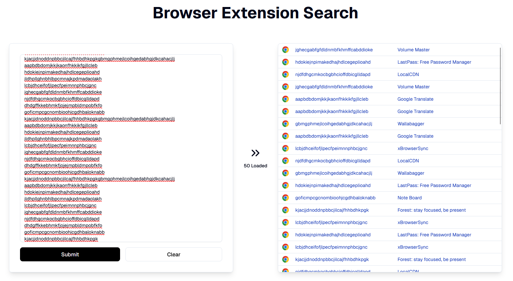

# Extension Search React

A web application built with Next.js and React for searching and displaying browser extension data.

## Getting Started

1. Install dependencies:
   `npm install`
2. Run the development server:
   `npm run dev`
3. Open http://localhost:3000 in your browser.

## Usage

- Search for browser extensions using the provided UI.
- View extension details in a responsive table.
- API endpoint available at /api/get_extension_data.
